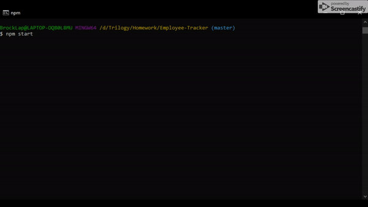

# Employee-Tracker

# Table Of Contents
- [User Story](#User-Story)
- [Overview](#Use)
- [Technologies Used](#Tech-Used)
- [Installation](#Installation)
- [License](#license)

### User Story
As a business owner 
I want to be able to view and manage the departments, roles, and employees in my company 
So that I can organize and plan my business

### Overview
This application is a employee management system. A user can add departments, roles, and employees, as well as viewing employees based on their role and department. This is a terminal based application so there is no link to a deployed application.

### Technologies Used
<ul>
  <li>mySQL</li>
  <li>Express</li>
  <li>Node.js</li>
  <li>inquirer</li>
</ul>

### Installation
Begin by cloning this repository, run <code>NPM INSTALL</code> in the root of the directory. You can then run <code>NODE SERVER.JS</code> in the terminal, and the application will launch.
  
### MIT License

Copyright (c) 2020 Brock Thigpen

Permission is hereby granted, free of charge, to any person obtaining a copy
of this software and associated documentation files (the "Software"), to deal
in the Software without restriction, including without limitation the rights
to use, copy, modify, merge, publish, distribute, sublicense, and/or sell
copies of the Software, and to permit persons to whom the Software is
furnished to do so, subject to the following conditions:

The above copyright notice and this permission notice shall be included in all
copies or substantial portions of the Software.

THE SOFTWARE IS PROVIDED "AS IS", WITHOUT WARRANTY OF ANY KIND, EXPRESS OR
IMPLIED, INCLUDING BUT NOT LIMITED TO THE WARRANTIES OF MERCHANTABILITY,
FITNESS FOR A PARTICULAR PURPOSE AND NONINFRINGEMENT. IN NO EVENT SHALL THE
AUTHORS OR COPYRIGHT HOLDERS BE LIABLE FOR ANY CLAIM, DAMAGES OR OTHER
LIABILITY, WHETHER IN AN ACTION OF CONTRACT, TORT OR OTHERWISE, ARISING FROM,
OUT OF OR IN CONNECTION WITH THE SOFTWARE OR THE USE OR OTHER DEALINGS IN THE
SOFTWARE.
